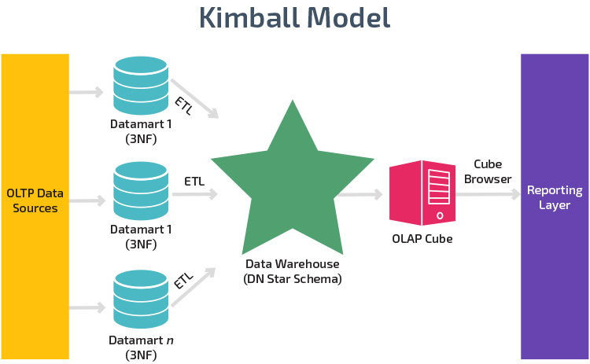
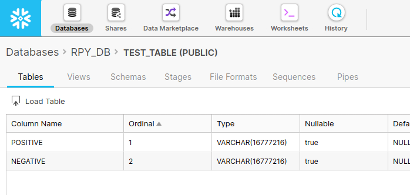
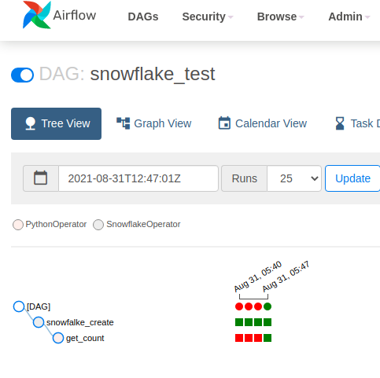

## Challenge 1
As you can probably imagine, data is growing and changing fast. Some tables  that were put together by skilled data scientists are no longer working properly and are   breaking due to data inconsistencies.

### How would you propose to keep track of the tables that are breaking in order to provide your teammates with the latest information?

I consider that in order to identify the cause of the problem it is necessary to look at the schema of the tables involved and reevaluate if the union method of the tables is still valid, since a probable cause of the problem could be a change in the primary key of the table (like adding an additional field to a composite primary key).

Check if any of the tables involved does not have a key that supports the union method implemented (or does not have a primary key).

If this is not the case, it could also be verified that all the tables involved continue to provide new data or if there was an interruption in the flow of data at some point that could cause missing data.

Depending on the problem that has been identified, I would propose to take one of the following actions:
- If a change occurred in the schema: Fit the junction as soon as possible (probably with a grouping) and maybe implement a validation mechanism to detect changes in the schema of the tables.
- If it is because one of the tables has a primary key inconsistent with the union method (or does not have a primary key), the uniqueness of the data could be enforced by grouping according to the columns that would form the primary key considered for the union.
- If it is due to missing data: try to identify and isolate the section of the data that could not be completed by all the tables involved and later reconsider the method used to join the tables since, due to the nature of the source of information, another more flexible mechanism could be more effective as an API to ingest the data.

Considering that the cause of the problem could not be among the above, the method to solve the problem could be a little different.


## Challenge 2
Sometimes real time data is needed for analysis. Nevertheless, this should be planned carefully in order to maintain system performance.
### Design a data pipeline strategy for real time data streams that allows scalability.
I propose a pipeline with the following architecture:
<p align="center"></p>

The data flow begins with the ingestion API, which is responsible for validating the data and passing it to the streaming service, it can be a RESTful API or an API service from a cloud service provider.

For the streaming service is proposed to use Apache Kafka or Amazon Kinesis.

Passing the streaming service is Amazon SNS for events subscription.
This component was added with the aim of reducing the complexity of the pipeline and facilitating scaling, since it is responsible for managing subscriptions, in general terms, when entering a new data SNS is responsible for sending it if there is any consumer subscribed to that topic.

There are two final storage points, a low latency API and a long term storage for analysis.

For the low-latency API I propose to use DynamoDB and some alternative for API.

And finally for storage in long terms I propose to use AWS lambda to receive requests and Google Big Query as a popular and scalable option.

## Challenge 3
It is a common practice to have many systems scattered all over: where one might be hosting the app, others might be hosting models needed for daily operations.
This usually benefits usability over scalability.
Nevertheless, data centralization is crucial for data exploitation.
For simplicity, imagine there are 4 systems: 

- The first system hosts the app. It generates data that is stored in an internal database (ignore the database’s architecture for now). Every time the user interacts with a screen, clicks a button, or opens the app, this is stored as an event.
- The second system hosts the risk model. Every  time a customer asks for  a credit, the system retrieves the risk data from the credit bureau and evaluates whether the customer is prone to be a defaulter.
- The third system hosts the customers information. Here, unrestricted information is hosted. This database contains the name, address, email, etc.
- Finally, the fourth and last system hosts all the payments information,  this means, all the information related to the usage of the credit card:  swipes, payments, recurrent payments, credit line, etc.

All systems share a unique identifier for all of our customers. This is the key that allows data to be joined on other databases.
### What should we do to centralize the data in order to display it in charts for KPI monitoring? What would you propose the data governance strategy should be?

To be able to access the data successfully it is recommended to implement a Data Waresouse with a Kimball architecture with a star model.
<p align="center"></p>

Below is a summary with some of the main points for the data governance strategy:

#### Goal
Understand the nature, behavior and market needs to improve products and services and enhance the growth of the company.

#### Metrics
- Satisfaction percentage.
- Average number of transactions per customer (per month).
- Average transaction amount.
- Growth rate of the number of users.

#### Decision making
Decisions usually require speed and authority, so a hierarchical model is recommended.

#### Communicate policies
Report data governance policies and relevant adjustments through meetings and emails.

#### Audit
For this phase, it is important to correctly document each step of the governance strategy and its implementation in order to identify possible causes of errors, as well as to audit the processes regularly.

## Challenge 4
### Design and implement a data pipeline using Apache Airflow and Snowflake. You can make use of any publicly available dataset. Write about how you did it, which challenges you encountered, and how you managed to  tackle such challenges.

After researching the basic information of the technologies involved, I entered the Airflow documentation to create the docker container, my first problem was that the Snowflake connector was not installed by default, so I created my own docker image based on the Airflow base image and used it to install the Snowflake connector, then I modified the docker-composer.yaml file to use my new base image.

After I created a Snowflake account, I had problems with some connection parameters so I looked in the Airflow documentation.

Once configured create the database table and look for a basic Dag to use as a base, also while seeing some examples I decided to use the Covidtracking API for my pipeline.
My goal was to create a pipeline that extracted the data of the number of positive and negative cases of the current day and saved them in the database, for reasons of practicality I decided to limit the data to extract only data from the state of California.

I create a database to store the values of interest.
<p align="center"></p>

Once the Dag was finished I corrected some syntax errors and I was able to verify that the data was inserted correctly.

<p align="center"></p>

Resulting in the following docker container, which can be used as follows:
```bash
docker-compose up
```
